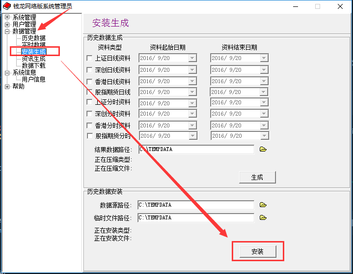
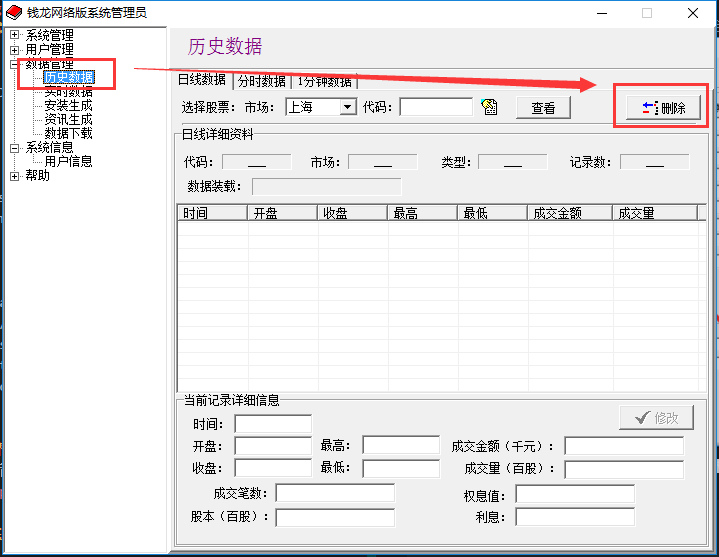
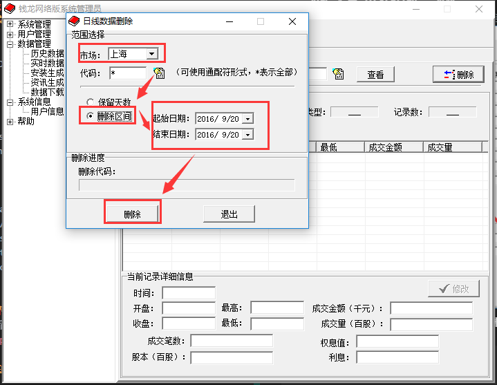

# linux wmanager 删补数据方法

## 工具下载
**linux wmanager** [ 百度云 ](http://pan.baidu.com/s/1eR4Kmgq)

## 准备工作
1.在linux服务器所在的网段上映射linux，例如 点对点/serviceconfig所在的PC机器上映射。
映射格式
```
//linux服务器IP地址/_opt
```
linux系统版本是redhat 6.2、7.0的不会提示输入密码，**centos 7.2 会提示输入账户密码 账户 qianlong 密码123456**

2.下载日线数据

下载地址 http://www.qianlong.com.cn/soft/download_data.aspx
会现下载到一个 **年月日.rar 文件**

```
将解压的文件 DISK1.DAT、SHA.DA_、SZN.DA_ 放到 C 盘根目录TEMPDATA目录 //没有请手动创建
 ```

## 数据安装
1. 工具下载完毕解压到 点对点/serviceconfig所在的PC机器上
2. 解压会有两个文件 mypath.ini和WManager.exe
3. 打开mypath.ini文件
```
[Path]
DataPath=y:/qianlong/sysdata/
LogPath=y:/qianlong/service/market/log/
ProgramCfgPath=y:/qianlong/service/market/cfg/
SysCfgPath=y:/qianlong/right/
CfgPath=y:/qianlong/syscfg/cfg/
UserPath=y:/qianlong/
```
**修改y为自己所映射的linux盘符**
4. 打开WManager.exe→点击数据管理→安装生产→点击安装→等待安装完成。  


5. **Linux7.2以下版本需要赋权操作，7.2以上(包括7.2)的就不需要了。**
赋权命令如下，需root用户权限执行  
```
chmod -R 777 /opt/qianlong  
chown -R qianlong:qianlong /opt/qianlong  
```

## 删除日线方法
操作方法同上  



