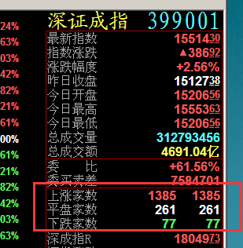
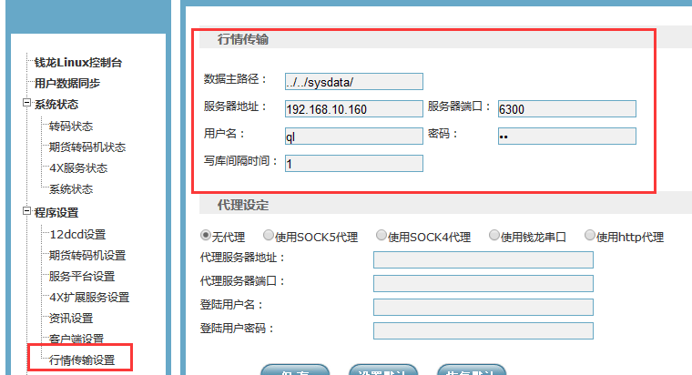
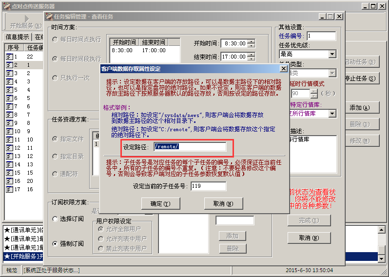
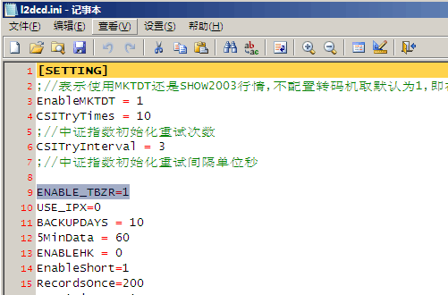
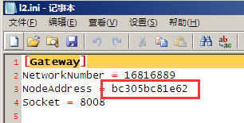
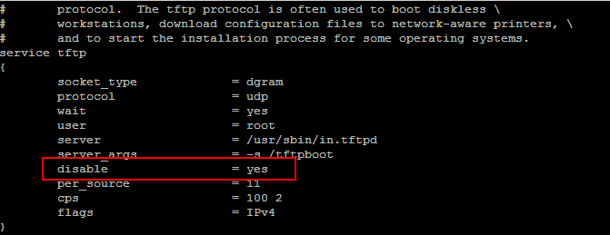
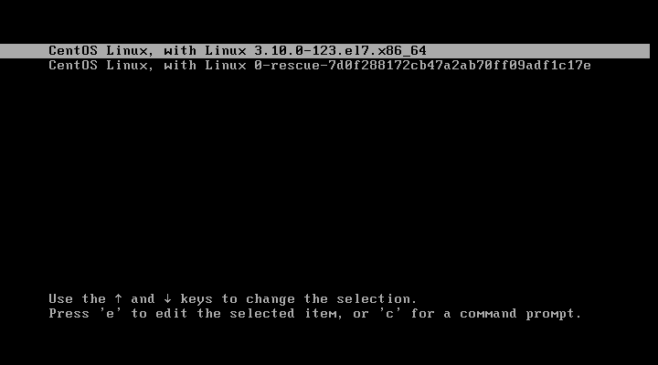
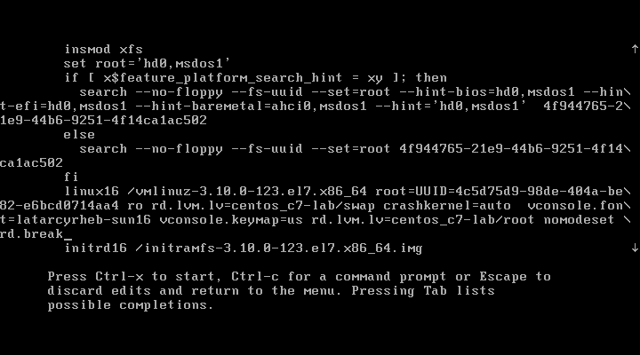
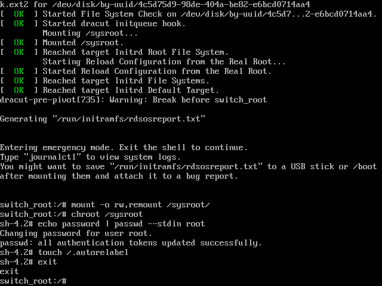
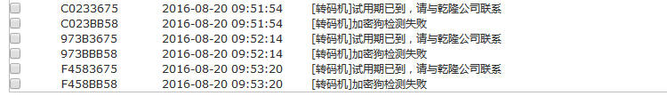

# 钱龙产品FAQ集  整理/收集 Andy hou

## 盘中各种数据线异常
中午或者收盘 替换realtime文件或者重新初始化

## 转码机时间错误
**故障说明：**
收不到行情库、
**解决方案：**
查看ml45目录 ml45\system\log\e150515.log  
log日志显示----行情库日期[20150516],系统日期[20120515]
修正转码机时间

## WMANAGER.EXE 管理员密码无法进去
默认密码qianlong  无法进入
system\cfg\目录下删除 sys.pwl文件

## 初始化时间
沪深 8：55～ 15：30
港股 8：55～ 16：30

## Londcd 上涨加速错误

如图显示的地方不正常
更换为l2dcd转码机

## 客户端登录提示非法用户 you may be illegal user
  
授权文件 ql4 
钱龙授权文件ml45\syscfg\mldata.ql4文件损坏。
当前用户对ml45\syscfg目录权限不够。
服务器可能有病毒，导致部分exe文件损坏

##　集合竞价时间9：25 但是显示9：30
Novell系统 9:30之前还没开盘呢。没有明细的。9:25的集合竞价价格是写在9:30的

##　Win转码死机
加参数  SYSTEM/L2DCD.INI 
 
公告信息过多、千兆网卡、使用了USB代理
(CPU 、信息公告、网卡、USB代理、映射novell服务器、内存使用率)
信息公告  
上海 
深圳

##　收盘转码死机 当天分时走势直线
10个dat的文件  收盘转成分时走势  10天的 
替换必须商品数量一样 

## 无狗密码不对
检查转码机时间

## 个股分时走势断掉或者乱了
1.行情接收问题 2.Novell映射问题
检查 Novell服务器 dirty cache buffers值 是否超过1000 （正常1千一下）

检查 龙讯接收 ml45\TOOLS\lxinfo  改成1000以下

## Dirty Cache Buffer很高，怎么办？
 问题或背景资料：LH4上运行NetWare 4.11非常慢， 利用MONITOR工具发现CPU利用率很高， Dirty Cache Buffers高达40000，我应怎么办？ 
    实际上你还会看到Current disk requests也很高，硬盘灯频繁闪动，在这样的情形下，NetWare 4.11非常慢与磁盘子系统相关。Dirty Cache Buffers and Current Disk Requests很高，表示等待写到磁盘的CACHE数量及pending的磁盘请求很高。LH4的硬盘通常采用阵列方式，因此请在阵列配置工具中修改write policy,将其由write through改为write back。其次请注意 IRQ资源的使用，避免使用 IRQ 2， 9， 15。最后，可以调整以下参数：
SET Maximum Concurrent Disk Cache Writes = 500
SET Dirty Disk Cache Delay Time = 0.5
SET Maximum Concurrent Directory Cache Writes = 100
附： writethrough方式将数据写入CACHE的同时也写入磁盘，write back方式先将数据存入CACHE，直到CACHE数据满，才写入磁盘中。write back方式更有效，但write through有更好的安全性。

## 有写出错次数的
l2dcd写文件失败(有写出错次数)常见原因：
1.信息公告文件数过多（超过2600）
2.novell服务器dirty cache buffers值过高（平均大于2000）
3.网卡效率低下
4.转码机千兆网卡，效率过高，导致服务器来不及响应。

针对以上原因处理方法：
1.删除历史信息公告文件，路径依据system\netdrv.ini中的shmsg,shnote,szmsg,sznote
2.联系服务器供应商检查阵列卡电池，或修改服务器相关读写参数
3.更换独立网卡，使用100M网卡
4.同3
5.在本地system\l2dcd.ini中[SETTING]项下，加入SingleCpu=1字段
[SETTING]
SingleCpu = 1 

## 关于替换拷贝realtime文件
1.覆盖之前先备份数据！
2.核对行情文件是否一样！ 核对商品数量！
替换不掉 关掉 转码机、踢掉所有客户端，可以在Novell服务器上看得到

## 涨跌停价格不对 
盘中替换实时数据 ，因为初始化不对

## 补日K线 2种方法
ml45\TOOLS\lxinfo\DayDown  
SERINFO.INI 

## UT5 收FAST 行不到mkdtd00

## 对比行情库速度
Dbfexplorer.exe  
 
上海比s2数据  SHOW2003.DBF
 
深圳比HQCJBS  SJSHQ.DBF
 

## linux自选股 不保存
重建软连接 user2 自选股不能保存到服务器上 
``cd /opt/qianlong/client/lonld `` 
``rm –rf usrcfg`` 
``ln –s /tmp/usrcfg usercfg`` 
``rm –rf data`` 
``ln –s /tmp/data data`` 

## Novell 转码机分笔明细少
1. dirty cache buffers 值 过大
2. 公告信息数过多 公告信息 ml45\SYSTEM\CFG\DBFPATH.INI 
3.	londcd换转码机 l2dcd

## LINUX DHCP 重新分配
命令 `` Setup_config ``

## 设置 HKDCD 收盘时间 
Wmamager 

## 行情第一分钟跳空
转码机时间快一分钟

## Linux 服务平台开不起来
看日志 转码机系统日志 、行情传输日志 、数据中心、点对点传输路径
 
1.查看系统状态 沪、深、港行情库 路径
 
行情传输
 
 

## 上海l2 十档界面  五档数据
先查l2状态
 
转码机设置
 
数据中心
 

## Upgrade 做升级 / 双龙
确保Upgrade/mldata.ql4  只有这一个文件 
 
Novell  
upgrade.exe /P=X:\ml45

1、使用UPGRADE做延期时第一步或第四步提示“T_Lock not found!”或者“upgrade t-lock error！”。多次更换无盘站无效。
A．将并口狗插入windows 有盘站上，并拷贝服务器映射盘符内的ml45\system\driver目录下的BKDRIVER.RAR至windows本机解压缩，执行解压后的setup.exe，完成并口狗驱动安装后，cmd命令行下进行upgrade延期。
2.2、使用UPGRADE做延期时第二步报错“Target path error！”，提示无法找到文件路径。
A.当前ML45的路径非F盘，重新UPGRADE并指定ML45路径，例如upgrade /p=z:\ml45。

B.ML45\SYSCFG目录下不存在MLDATA.QL4文件或文件已损坏，请先拷贝一个MLDATA.QL4文件至该目录下再做UPGRADE。

2.3、使用UPGRADE做延期时第三步报错“Copy ql4 file error！”，提示无法拷贝文件。
A.upgrade目录下存在多个ml****.ql4文件，清除多余的ml****.ql4文件后重做upgrade。

B.ML45\SYSCFG目录下的mldata.ql4文件被设定为只读，改为存档后重新upgrade。

C.当前用户没有足够的操作权限，请重新赋权后做延期。

## 上证领先指标中白线和黄线的含义 
白线是上证指数走势图，黄线是不含加权的上证领先指数走势图。
黄线的算法不同，有的软件是使用均价的方式计算的。我们是使用算术平均方式来计算的，本质上还是指数加权的算法。只是权重都是一样了。
因上证指数是以各上市公司的总股本为加权计算出来的，故盘子大的股票较能左右上证指数的走势，如马钢、石化等。而黄线表示的是不含加权的上证指数，各股票的权数都相等，所以价格变动较大的股票对黄线的影响要大一些。这样，当上证指数上涨时，如白线在黄线的上方，它说明大盘股的影响较大，盘子大的股票涨幅比盘子小的股票要大；反之，如黄线在白线的上方，就是小盘股的涨幅比大盘股要大。而当上证指数下跌时，如黄线在白线的下方，它表示大盘股的下跌幅度较小而小盘股的股票跌幅较大；反之，如白铁在黄线的下方，它表示大盘股的跌幅比较大。

## Linux融资融券 前面没有R 
/opt/qianlong/syscfg/cfg 目录 下需要更新  找龙讯

## 大盘均为红色
 
某一时刻，买卖力道，买的力道大于卖的力道，即显示红色。

## Linux 看到不到沪港通 4X服务状态 显示如下 无监控数据列表
 
删除/opt/qianlong/sysdata/history/neeq/hisexdata.szn
使用文件大小计算记录数时，超过了数据保存范围（64K）

## Linux 港股通F10龙讯
拷贝 \qianlong\service\hqsystem\hk2sh\libtran2ndhk2sh.ini
然后覆盖到
\qianlong\service\hqsystem\4xinfo\libtran2ndhk2sh.ini
然后重启4X 服务   注意：改帐号密码为 ql

## 日线数据对比
沪深日线 Linux =Novell （大小写）
期货 Linux =Novell （大小写）
港股通 Linux =WIN 

## N和L内外盘不同
不同软件的个股内外盘数量不一致
各软件厂商的计算方法和转码机的行情延迟时间均不同造成的。
总量是一致的，内外盘不一致属正常。
F1成交明细的现量是由前一笔总量与后一笔总量相减得到的。有切片时间差存在。
转码机扫库是按每次扫多少个股票，这个股票数量是由转码机程序l2dcdset.exe中设置的扫库速度决定的。比如150，那就是说，转码机每次读扫150个股票，每次扫库间隔为0.5毫秒。
影响切片时间差的因素有：机器性能、网络环境、网卡效率、磁盘读写速度、转码机转码效率、扫库起始代码、行情库刷新落地时间等。只要其中有一个差异就会造成切片差异，进而造成F1成交明细和内外盘差异。
内盘：就是股票在买入价成交，成交价为申买价，说明抛盘比较踊跃
外盘：就是股票在卖出价成交，成交价为申卖价，说明买盘比较积极
F1成交明细卖出价成交，红色量，算作外盘。
F1成交明细买入价成交，绿色量，算作内盘。
F1成交明细价格，白色中间量，内外盘各加50%。

## Linux 信息公告以及日志清理
信息公告  
\qianlong\sysdata\remote\msg
\qianlong\sysdata\vsat\info
日志文件 \qianlong\logs
配置文件 
 
\qianlong\service\market\cfg\l2dcd.ini
//公告文件保留天数
\qianlong\service\servicemanager.ini
 

## linux特別转让取消转
 
/opt/qianlong/service/market/cfg/l2dcd.ini
ENABLE_TBZR=1改成0

## 信息雷达 不显示
 
 

## Linux 跑马灯设置 
qianlong\sysdata\news\pmd1.txt 可手动设置 

qianlong\sysdata\mlinfo\pmd2.txt 龙讯推送

## 初始化数据处理逻辑
初始化数据处理逻辑[1]
初始化数据处理逻辑[2]
没到初始化时间，数据没到。

## 十档数据慢
1.先停掉龙讯看一下
2.重启一下USB代理 

## 2960S 交换机无盘站
1，在3560上，把接入linux server的那个端口的速率限制为100M，双工模式改为自动；
2，在2960上，把相应的接入无盘工作站的所有端口的速率也限制为100M，双工模式都改成自动；
交换机设置  
``Switch>enable `` 
``Switch#show running-config`` 
``Switch#configure terminal `` 
``Switch(config)#span portfast default `` 
``Switch(config)#interface fastEthernet 0/1   ``     //Switch(config)#interface range fastEthernet 0/1-24 
``Switch(config-if)#shutdown ``//关闭端口  
``Switch(config-if)#speed 100 ``   //速度100M 
``Switch(config-if)#duplex auto ``   
``Switch(config-if)#no shutdown ``   //打开 
``exit`` 
``exit`` 
``Switch# show running-config``    //看配置  
``Switch#write ``   //保存  
``Switch#reload ``   //重启  

## 上海10档 五档数据
数据中心正常 更换转码机 更换mac地址
 

## Linux 无盘站颜色
 
/tftpboot/pxelinux.cfg/default 
删掉 vga=0x301

## Linux 7.0 跨网段
/etc/xietd.d/tftp
 
改成yes
----------------------------------------------------------------
``subnet 192.168.2.0  netmask 255.255.254.0 {`` 
``                	range dynamic-bootp 192.168.3.2  192.168.3.250;`` 
``default-lease-time 1600;`` 
``max-lease-time 3200;`` 
``next-server 192.168.2.154;`` 
``filename "pxelinux.0";`` 
-----------------------------------------------------------------
垮过 255 和0地址
改eth0 的子网掩码

``subnet 192.168.2.0  netmask 255.255.254.0 {`` 
``					range 192.168.2.10 192.168.2.254;`` 
``					range 192.168.3.2 192.168.3.254;`` 
``default-lease-time 1600;`` 
``max-lease-time 3200;`` 
``next-server 192.168.2.154;`` 
``filename "pxelinux.0";`` 
-----------------------------------------------------------------

## linux委托 港股通每手股数
 
是港股通初始化的问题，保证数据中心港股通源驱动时间早于 linux上设置的开盘的时间 
 
 
如果是盘中 要恢复显示的话，就重启4X服务平台
如果还不显示 就是要 删掉实时文件， 重新启动\qianlong\sysdata\realtime\hk2sh

## Root 忘记密码
RHEL/CentOS 7 重設 root 密碼 
開機後在 GRUB2 選單畫面，選擇要使用的 kernel 版本（一般為第 1 項），輸入 e。
 
尋找 linux16 項目，在最後面在入 rd.break。
 
輸入下列指令：

``switch_root # mount -o rw,remount /sysroot/`` 
``switch_root # chroot /sysroot/`` 
``sh-4.2 # echo password | passwd --stdin root``  //passwd 就是新密码
``sh-4.2 # touch /.autorelabel`` 
``sh-4.2 # exit`` 
``switch_root # exit`` 
 

## 强制卸载光驱
fuser -km /mnt/cdrom

## Novell 客户端一半小棒不转
 
 
无盘站看网段号 命令 nlist user /a 
 
客户端 nlist user /a  查看无盘站的网段号，对转码机ipx发包改成手动 802.3 添加网段号

## 服务管理器端口占用 
 
改端口号 重启

## 短线精灵 断掉
实时文件写出错 ，删掉这两个文件
Lonbig.sha
Lonbig.szn

## NOVELL平台的l2dcd发生成交明细极少的情况
各位，近期遇到NOVELL平台的l2dcd发生成交明细极少的情况，先按写出错方法处理，若尝试无效，请使用开发给出临时解决方法如下：
在l2dcd.ini中修改MaxTickInterval参数，改成15，以减轻I/O压力。 
 

## Linux 初始化数据处理逻辑[1] 
校准linux时间
 

## novell初始化 客户端未退出
ml45\SYSDATA\REALTIME 
删除 dcdinfo.dat

## 无时间 有小棒 发包慢 有行情
Novell 时间不对 

## 品种名称转换失败
 
商品期货没升级
关于郑商所“动力煤”期货合约代码变更升级公告

## Novell沪深个股 划线只有当前一分钟 切换一下就没有了
实时文件读写有问题，服务器性能 网卡 缓存 lon2.bat内存加载问题 

## Linux 认证问题
检查 服务平台 服务器IP地址设置 
 

## 降低期货的IO 
 

## 部分客户端看不到 11  
加载不出来 cmos memory hole  修改 为 disable

## 上海公告 配置文件 保留天数
 

## linux转码机到期日 linux提示加密狗检测失败
 
 

## linux 客户端列表 文件列表
``/var/lib/dhcpd/``
Linux 分配IP地址 网卡地址 
 

## linux web登录admin 登陆不上
 
给html赋权
cd /var/www
chmod -R 777 html

## linux fjy路径
默认是在 \opt\qianlong\service\market\cfg\netdrv.ini

## 港股通股票名称不对
替换namehk.DBF

## NTVDM 遇到一个硬错误 XP 2003
 
微软解释
https://support.microsoft.com/zh-tw/kb/937932
Wow32.dll 模組沒有轉換的 DEVMODE 資料結構從 16 位元的 Windows 3.1 版成 32 位元 ANSI 版，就會發生這個問題。因此，Ntvdm.exe 程序會使用 DEVMODE 緩衝區大小錯誤，若要將資料傳送至印表機多工緩衝處理器服務。 
解决：下载 hotfix 补丁 
程序包：

知识库文章编号：968730
语言：Chinese (Simplified)
平台：i386  XP
位置：(http://hotfixv4.microsoft.com/Windows%20XP/sp4/Fix251294/2600/free/375549_CHS_i386_zip.exe)

知识库文章编号：968730
语言：Chinese (Simplified)
平台：i386 2003
位置：(http://hotfixv4.microsoft.com/Windows%20Server%202003/sp3/Fix262679/3790/free/375507_CHS_i386_zip.exe)

## linux web升级版本号不刷新
/var/lib 目录重新覆盖一下
 

## linux 4X或者转码机 按钮按不下去 
1.缺少 hktime.ini 文件 /opt/qianlong/service/market/CFG/hktime.ini 
2.root权限执行了转码机和其他程序 
``top`` 查看命令 
``./l2dcd`` root权限运行 
``killall l2dcd`` 杀掉进程 

## linux 础MKTDT行情异常,上海市场行情被中止!!
[上海库]打开MKTDT文件(/opt/qianlong/sysdata/remote/mkdtd00.txt)错误,错误码(0) 
[上海库]打开MKTDT文件(/opt/qianlong/sysdata/remote/mkdtd00.txt)错误,代码(-2147483646) 
[上海市场]初始化基础MKTDT行情异常,上海市场行情被中止!! 
[上海]市场启动MKTDT行情驱动失败 
[上海市场]启动行情驱动发生错误 

检查 netdrv.ini 文件 L2DCD 文件 是否mktdt配置多加了一行 

## 点对点时间0：00 问题
 
修改系统时间为24小时制

## 83 五分钟涨跌幅不对
netdrv.ini 是不是转了老三板
STBZR=d:\remote\stbhq.dbf		//老三板行情库（三板行情已有独立转码机，若有请删除该条配置项） 
STBXX=d:\remote\stbxx.dbf		//老三板信息库（三板行情已有独立转码机，若有请删除该条配置项） 

# systemctl restart network
在日志文件中查看具体的错误原因：
`` cat /var/log/messages | grep network ``

# nfs 错误
 
检查/tftpboot/pxelinux.cfg/default 里的IP地址是否有问题
