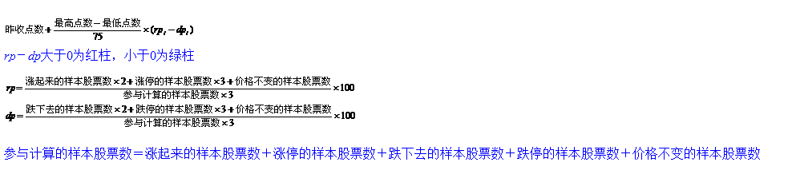
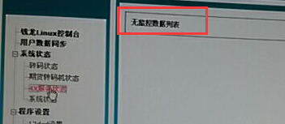
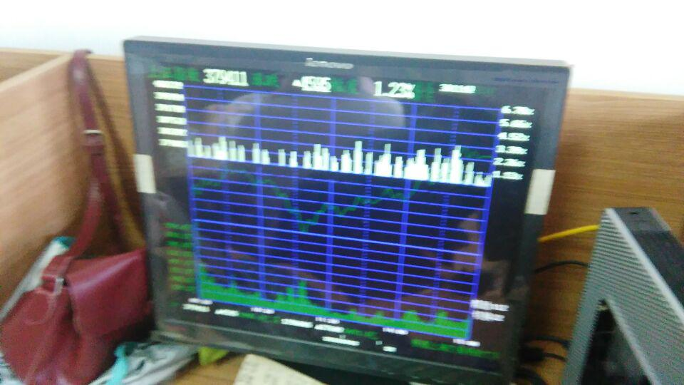
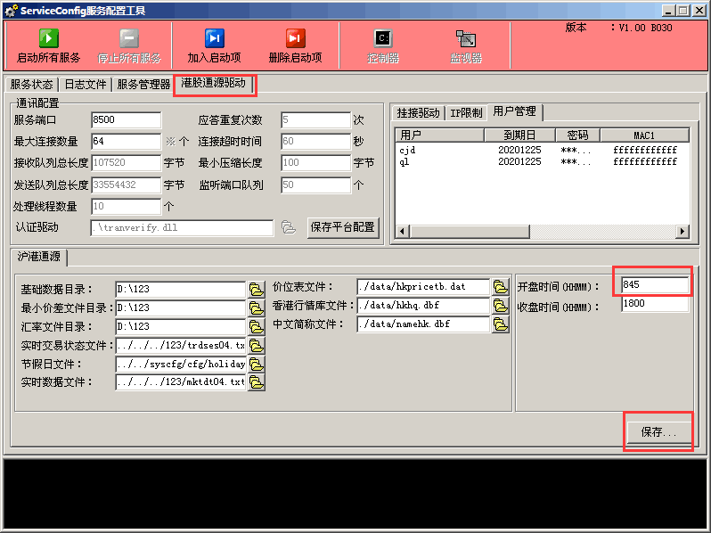
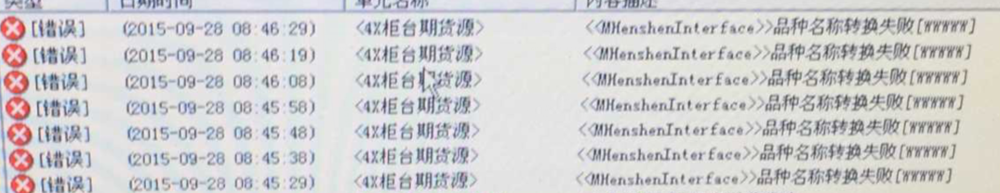
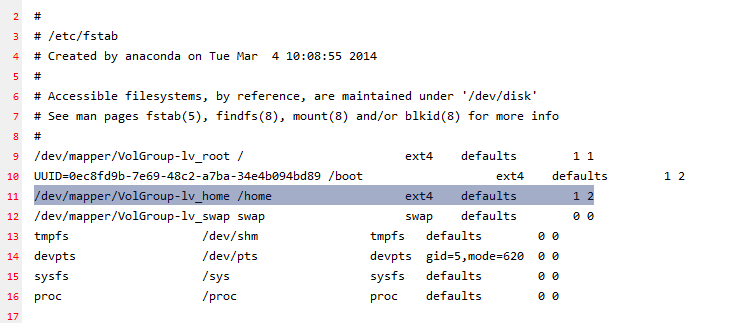
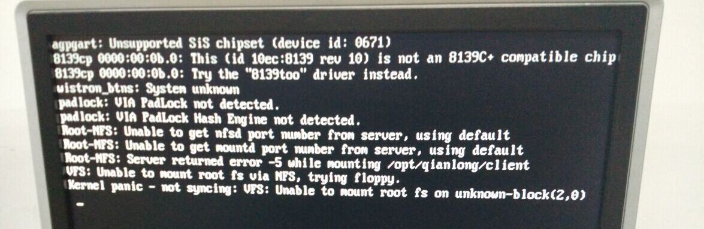
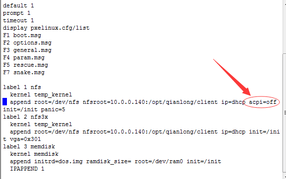

# 钱龙Linux FAQ 集

> 文档过长建议使用浏览器搜索"Ctrl + F"进行页内关键词搜索

<font color=red><font size=5.5em>在遇到各种稀奇古怪的问题之前，请确保您已经做到以下几点：
</font>
* 99%的情况下，任何设置都可以在web页面进行。这也是我们推荐的唯一方式，强烈不建议直接修改配置文件的做法，如果实在需要，请先咨询技术支持。
* 服务器正常工作时开机即可，不需要登录。控制、设置都通过web进行。
* 除了做系统升级时，按说明要求需使用root用户时，才使用root用户登录进行操作。其他时候请使用qianlong用户，比如延期、补数据等。
* 除了极个别的系统升级，需要您进行赋权操作之外，如果你觉得需要进行赋权操作，那么一定是什么地方错了。
* 如果在qianlong用户登录的情况下，实在需要root权限执行某个命令，那么就在要执行的命令前面加上'sudo ',例如:
    <code>sudo systemctl restart nfs</code>
</font>


以下操作除特别说明之外，请均<font color=blue size=5.5em>使用`qianlong`用户进行操作</font>！

## 1. 盘中各种数据画线异常
[补实时数据]({{ site.url }}/#!sysdata.md#cprealtime)

## 2. Linux服务器时间校准
现象：Linux初始化时间未进行初始化，转码机状态显示初始化数据处理逻辑\[1]

有以下两种解决方法：
* 在"钱龙Linux控制台"界面有个"时间同步"按钮，在确认本机时间正确的情况下，点击该按钮，会自动同步本机时间到服务器。
* 以下命令行方式不推荐，需要root用户进行操作。  
##### Linux6.2版本
```
date 　　　　　　　　//显示时间
date -s 20160301 　　　　//修改日志
date -s 9:30:00 　　　　//修改时间
hwclock -w 　　　　//写进主板

```
#####linux7.0以上版本
```
timedatectl set-time 9:30:00
timedatectl set-time 2016-10-28
```

## 3. 涨跌停价格不对
中午替换realtime文件 方法见[补实时数据](http://qlfaq.com/#!sysdata.md)
原因是因为初始化不对，可能原因卫星接收行情库晚，初始化早，或者点对点打开晚

## 4. 补日K线方法

**<font color=#ff9900 size=2 >  ⚠ 详细教程参见[补历史数据](http://qlfaq.com/#!sysdata.md)</font>** 

上海日线位置```opt/qianlong/sysdata/history/shase/day```

深圳日线位置```opt/qianlong/sysdata/history/sznse/day```

港股通日线位置```opt/qianlong/sysdata/history/hk2sh/kday```

期货日线位置```opt/qianlong/sysdata/history/cnfol/day```

股份转让日线位置```opt/qianlong/sysdata/history/neeq```

## 5. Linux自选股不保存
修复自选股软连接
```
cd /opt/qianlong/client/lonld
rm –rf usrcfg
ln –s /tmp/usrcfg usrcfg
rm –rf data
ln –s /tmp/data data
```
## 6. Linux DHCP地址池重新分配
在web页面上"工作站管理->DHCP配置处修改"并重启DHCP服务。

## 7. Linux 服务平台启动不起来
看系统状态里的转码状态是否正常，流驱动 沪盘中、深盘中？读库 还是 初始化 查看日志 转码机系统日志 、行情传输日志 、数据中心  服务平台启动不起来 一般就是初始化没完成

## 8. 上证领先指标中白线和黄线的含义
白线是上证指数走势图，黄线是不含加权的上证领先指数走势图。 黄线的算法不同，有的软件是使用均价的方式计算的。我们是使用算术平均方式来计算的，本质上还是指数加权的算法。只是权重都是一样了。 因上证指数是以各上市公司的总股本为加权计算出来的，故盘子大的股票较能左右上证指数的走势，如马钢、石化等。而黄线表示的是不含加权的上证指数，各股票的权数都相等，所以价格变动较大的股票对黄线的影响要大一些。这样，当上证指数上涨时，如白线在黄线的上方，它说明大盘股的影响较大，盘子大的股票涨幅比盘子小的股票要大；反之，如黄线在白线的上方，就是小盘股的涨幅比大盘股要大。而当上证指数下跌时，如黄线在白线的下方，它表示大盘股的下跌幅度较小而小盘股的股票跌幅较大；反之，如白铁在黄线的下方，它表示大盘股的跌幅比较大。

## 9. Linux融资融券 前面没有R A B Q 或者标志不对
```
opt\qianlong\syscfg\commark.ini
```
需要更新 找龙讯 或者其他营业部拷贝

## 10. 大盘均为红色

某一时刻，买卖力道，买的力道大于卖的力道，即显示红色。

## 11. Linux 看到不到沪港通 4X服务状态 显示如下 无监控数据列表
删除/opt/qianlong/sysdata/history/neeq/hisexdata.szn
使用文件大小计算记录数时，超过了数据保存范围（64K）
也有可能是Linux股转升级，后端口冲突，重启服务器即可。


## 12. Linux 港股通看不到F10龙讯
拷贝 \qianlong\service\hqsystem\hk2sh\libtran2ndhk2sh.ini

然后覆盖到 \qianlong\service\hqsystem\4xinfo\libtran2ndhk2sh.ini

然后重启4X服务平台和服务平台，注意查看文件里的IP地址是否正确。为服务器IP地址

## 13. Novell和Linux 内外盘不同
不同软件的个股内外盘数量不一致 各软件厂商的计算方法和转码机的行情延迟时间均不同造成的。 总量是一致的，内外盘不一致属正常。 F1成交明细的现量是由前一笔总量与后一笔总量相减得到的。有切片时间差存在。 转码机扫库是按每次扫多少个股票，这个股票数量是由转码机程序l2dcdset.exe中设置的扫库速度决定的。比如150，那就是说，转码机每次读扫150个股票，每次扫库间隔为0.5毫秒。 影响切片时间差的因素有：机器性能、网络环境、网卡效率、磁盘读写速度、转码机转码效率、扫库起始代码、行情库刷新落地时间等。只要其中有一个差异就会造成切片差异，进而造成F1成交明细和内外盘差异。 内盘：就是股票在买入价成交，成交价为申买价，说明抛盘比较踊跃 外盘：就是股票在卖出价成交，成交价为申卖价，说明买盘比较积极 F1成交明细卖出价成交，红色量，算作外盘。 F1成交明细买入价成交，绿色量，算作内盘。 F1成交明细价格，白色中间量，内外盘各加50%。

## 14. Linux 信息公告以及日志清理
通过web页面的"信息清理"和"监控消息管理"进行。2016年10月10日以前安装的用户需要升级2016年10月19日的升级之后方可正常工作。
信息公告

```
\qianlong\sysdata\remote\msg
```

```
\qianlong\sysdata\vsat\info
```

日志文件 \qianlong\logs

日志文件保留天数修改路径

```
\qianlong\service\market\cfg\l2dcd.ini
```

公告文件保留天数修改路径

```
\qianlong\service\servicemanager.ini
```

## 15. Linux 跑马灯设置
通过web页面的"资讯设置->跑马灯设置"进行设置。
```
qianlong\sysdata\news\pmd1.txt
```
可手动设置

```
qianlong\sysdata\mlinfo\pmd2.txt
```
龙讯推送

## 16. 初始化数据处理逻辑[1]
初始化数据处理逻辑[1] 初始化数据处理逻辑[2] 没到初始化时间，数据没到。

## 17. Linux 无盘站颜色 反色 绿色

```
/tftpboot/pxelinux.cfg/default
```
修改
```
vga=0x301   去掉这个字段
```

## 18. DHCP服务配置多个子网段
修改dhcp.conf
```
subnet 192.168.2.0  netmask 255.255.254.0 {

            　　　　　range 192.168.2.10 192.168.2.254;

            　　　　　range 192.168.3.2 192.168.3.254;

     default-lease-time 1600;

     max-lease-time 3200;

     next-server 192.168.2.154;

     filename "pxelinux.0";
```

## 19. linux委托 港股通每手股数
是港股通初始化的问题，保证数据中心港股通源驱动时间早于 linux上设置的开盘的时间
如果是盘中 要恢复显示的话，就重启4X服务平台 如果还不显示 就是要 删掉实时文件， 重新启动\qianlong\sysdata\realtime\hk2sh




## 20. 服务管理器端口占用

服务管理器改端口号6003或其他不冲突的端口，然后重启

## 21. 品种名称转换失败
商品期货没升级 关于郑商所“动力煤”期货合约代码变更升级公告


## 22. 客户端启动连接服务器认证失败
服务平台启动问题

## 23. Linux提示加密狗检测失败

linux转码机到期日

## 24. Linux 客户端列表 文件列表
```/var/lib/dhcpd/``` Linux 分配IP地址 网卡地址

## 25. linux web登录admin 登陆不上
权限问题，运行脚本修复权限，需在非开市期间才能执行。

```
/opt/qianlong/bin/fix_permission.sh
```

也有可能是linux服务器空间占满**redhat6.2存在问题**

以下步骤必须用root 用户操作

```
1. umount /home

2. 删掉/etc/fstab里面/home那行 如下图
cd /etc
vi fstab
打开fstab后，按a进入编辑模式，删除含home行，按esc退出编辑状态，按:wq保存退出文件。
```

```
3. lvremove /dev/mapper/VolGroup-lv_home

4. lvextend /dev/mapper/VolGroup-lv_root /dev/sda2

5. resize2fs /dev/mapper/VolGroup-lv_root

等到命令#跳出来 在执行下一步，上面一步可能要几分钟。

reboot

```


## 26. Linux web升级版本号不刷新
/var/lib 目录重新覆盖一下


## 27. Linux 4X或者转码机 按钮按不下去

1. 缺少 hktime.ini 文件
/opt/qianlong/service/market/CFG/hktime.ini

2. root权限执行了转码机和其他程序
运行脚本修复权限，需在非开市期间才能执行。
```
/opt/qianlong/bin/fix_permission.sh
```

## 28. Linux MKTDT行情异常,上海市场行情被中止!!
\[上海库]打开MKTDT文件(/opt/qianlong/sysdata/remote/mkdtd00.txt)错误,错误码(0)

\[上海库]打开MKTDT文件(/opt/qianlong/sysdata/remote/mkdtd00.txt)错误,代码(-2147483646)

\[上海市场]初始化基础MKTDT行情异常,上海市场行情被中止!!

\[上海]市场启动MKTDT行情驱动失败

\[上海市场]启动行情驱动发生错误

检测行情接收点对点 行情库是否传入Linux

## 29. 点对点时间0：00 问题


修改系统时间为24小时制

## 30. Linux无盘站启动nfs 错误



检查/tftpboot/pxelinux.cfg/default 里的IP地址是否有问题

## 31. 客户端选择系统工具-关闭计算机-关闭计算机后挂起

/tftpboot/pxelinux.cfg/default中是否有acpi=off，没有就加上。


