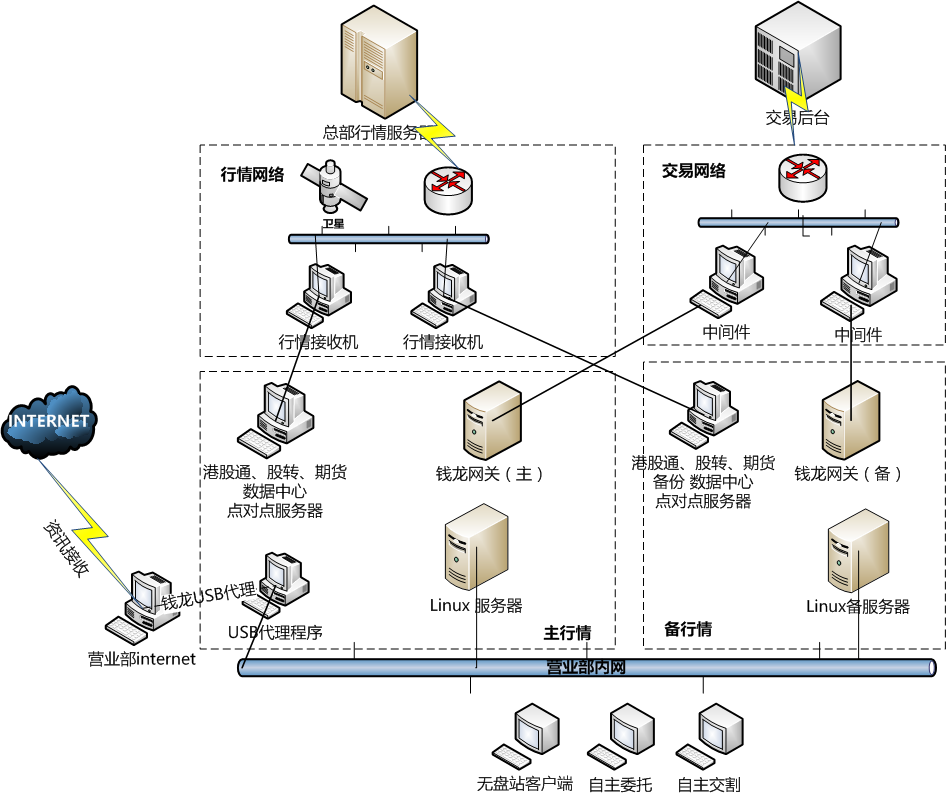

# 钱龙Linux的安装教程

## 拓扑图

## 安装环境准备
| 主/备服务器 | 数据中心/点对点服务器 |钱龙网关 |USB代理线/代理PC|无盘站|授权文件|
| ------ |:----------:|:----------:|:----------:|:----------:|:----------:|
| **操作系统** ：乾隆公司提供 Redhat/Cetos| **操作系统**：WINDOWS 2003 SERVER/XP|**操作系统**：WINDOWS 2003 SERVER/XP|**操作系统**：WINDOWS 2003 SERVER/XP|/|授权文件：ql4、ql6文件|
|**CPU处理器**：P4 Xeon 2.4G*2 内存: 8G及以上|**CPU处理器**：INTEL 或AMD处理器2.0GHz以上内存: 4GB及以上|**CPU处理器**：INTEL 或AMD处理器2.0GHz以上内存: 4GB及以上|**CPU处理器**：INTEL 或AMD处理器2.0GHz以上内存: 4GB及以上|**CPU处理器**：INTEL 或AMD处理器1.2GHz以上||
|**硬盘空间**: raid5阵列 阵列卡缓存512M（含）|**硬盘空间**: 10G可用空间|**硬盘空间**: 10G可用空间|**硬盘空间**: 10G可用空间|**内存**: 512MB及以上 VGA彩显 ||
|**推荐型号**: IBM X3650 M5系列、HP DL388 G9系列、DELL R730系列|**推荐型号**: 双网卡|**推荐型号**: 双网卡|**推荐型号**: 双网卡|**推荐型号**: 8139型号的PXE网卡||
|**安装方式**：光盘安装/USB安装||||||
|**服务器系统兼容查询**: [查询地址](https://access.redhat.com/ecosystem/search/#/ecosystem/Red%20Hat%20Enterprise%20Linux?category=Server) |||||　|

## 系统&程序下载

| 系统版本|文件名| 下载地址|文件大小|备注|
| ------ |:----------:|:----------:|:----------:|:----------:|:----------:|
|Linux(redhat) 6.2|rhel-6.2-i386-custom.iso| [百度云](http://pan.baidu.com/s/1bPOgSu)|524 MB|旧服务器光盘安装的系统版本
|Linux（redhat）7.0|rhel-7.0-x86_64-custom.iso|[百度云](http://pan.baidu.com/s/1kUWXvzL)|905 MB|光盘安装系统镜像
|**Linux（centos）7.2 推荐安装**|QL_LINUX7-x86_64-20161009.iso|[百度云](https://pan.baidu.com/s/1bpcHt1d)|1.12 GB|**U盘安装镜像(内置10月9日app&diskless)**

---------------
|Diskless & APP| 下载地址 |文件大小|备注|
| ------ |:----------:|:----------:|:----------:|:----------:|
|qianlong_diskless_iso_2016_09_19.iso|[百度云](https://pan.baidu.com/s/1nvrVYjv)|170.2 MB||
|qianlong_app_iso_2016_09_19.iso|[百度云](https://pan.baidu.com/s/1gfBfhcf)|19.3 MB|　|

---------------
|点对点服务端 & Serviceconfig| 下载地址|MD5 |文件大小|备注|
| ------ |:----------:|:----------:|:----------:|:----------:|
|点对点服务端 140|[百度云](http://pan.baidu.com/s/1dFFOSgx)|3A5452B58F9B44265C226405DD23FBCC|808 KB||
|Serviceconfig服务配置工具2016-01-21|[百度云](http://pan.baidu.com/s/1bpbXviB)|BC130640AA1B59D22AE0EA6F82A1BC50|23.9 MB|[官网下载地址](http://www.qianlong.com.cn/soft/download_wl.asp)|
---------------
|周边工具| 下载地址|备注|
| ------ |:----------:|:----------:|
|Winscp|[百度云](http://pan.baidu.com/s/1pLb8TtD)|SSH工具|
|Putty|[百度云](http://pan.baidu.com/s/1pLb8TtD)|推荐与winscp一起安装使用|
|转小写批处理|[百度云](http://pan.baidu.com/s/1mhHwsoK)|Novell 拷贝日线转小写到Linux|
|U盘烧录软件|[百度云](http://pan.baidu.com/s/1i5sajkT)|[官网地址](http://cn.ezbsystems.com/ultraiso/download.htm)|
|子网掩码计算器|[百度云](http://pan.baidu.com/s/1bp2vKjP)|营业部无盘站超过一个子网计算时用|
|浏览器||推荐 谷歌、火狐|

## 历史数据下载

> 补历史数据详细教程参考 [补数据](sysdata.md)

> 信龙官网 [xlinfo.cn](http://www.xlinfo.cn/)  **首页>技术支持>数据下载**

|历史咨询| 下载地址|备注|
| ------ |:----------:|:----------:|
|LINUX版龙讯C系列F10完整历史数据|[下载地址](http://www.xlinfo.cn/server/server10.html)|(每周五更新)|
|龙讯权息weight历史数据包|[下载地址](http://www.xlinfo.cn/server/server10.html)|(每周五更新)|

## 系统安装视频教程
### 钱龙Linux系统安装教程
<embed height="415" width="544" quality="high" allowfullscreen="true" type="application/x-shockwave-flash" src="http://static.hdslb.com/miniloader.swf" flashvars="aid=7013830&page=1" pluginspage="http://www.adobe.com/shockwave/download/download.cgi?P1_Prod_Version=ShockwaveFlash"></embed>

### 钱龙Linux5档配置
<embed height="415" width="544" quality="high" allowfullscreen="true" type="application/x-shockwave-flash" src="http://static.hdslb.com/miniloader.swf" flashvars="aid=7013830&page=2" pluginspage="http://www.adobe.com/shockwave/download/download.cgi?P1_Prod_Version=ShockwaveFlash"></embed>

### 钱龙Linux其他市场配置
<embed height="415" width="544" quality="high" allowfullscreen="true" type="application/x-shockwave-flash" src="http://static.hdslb.com/miniloader.swf" flashvars="aid=7013830&page=3" pluginspage="http://www.adobe.com/shockwave/download/download.cgi?P1_Prod_Version=ShockwaveFlash"></embed>

> ** 视频下载地址：[百度云](http://pan.baidu.com/s/1dEW3Brz)**

## 文档下载

钱龙场内Novell向linux改造解决方案.doc [百度云](http://pan.baidu.com/s/1qXNtL7m)

钱龙Linux（7.2版）网络版系统管理员手册.doc[百度云](http://pan.baidu.com/s/1bpN0ef1)

钱龙Linux（7.0版）网络版系统管理员手册.doc[百度云](http://pan.baidu.com/s/1geKos7L)

### 服务器安装Linux说明文档

HP ProLiant DL380-Gen9 安装说明.doc[百度云](http://pan.baidu.com/s/1i5lU7Sp)

hp388G9 raid5.doc[百度云](http://pan.baidu.com/s/1hssIiAK)

Dell PowerEdge R730 安装说明.doc[百度云](http://pan.baidu.com/s/1hsPmlgg)

Lenovo(IBM) System x3550 M5 安装说明.doc[百度云](http://pan.baidu.com/s/1bGuIa6)
