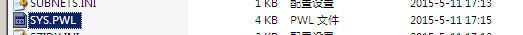
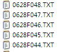
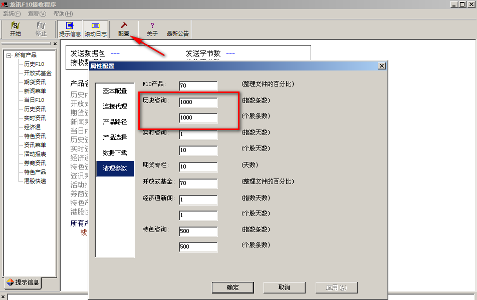
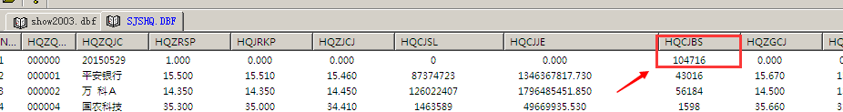
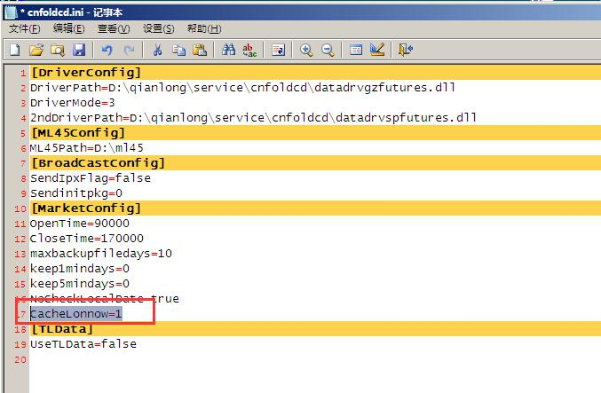

# 钱龙Novell FAQ 集

> 文档过长建议使用浏览器搜索"Ctrl + F"进行页内关键词搜索

## 1.盘中各种数据线异常
中午或者收盘 替换realtime文件或者重新初始化

## 2.转码机时间错误
**故障说明：**
收不到行情库、
**解决方案：**
查看ml45目录 ml45\system\log\e150515.log  
log日志显示----行情库日期[20150516],系统日期[20120515]
修正转码机时间

## 3.WMANAGER.EXE 管理员密码无法进去
默认密码qianlong  无法进入
system\cfg\目录下删除 sys.pwl文件

## 4.客户端登录提示非法用户 you may be illegal user
  
授权文件 ql4 
钱龙授权文件ml45\syscfg\mldata.ql4文件损坏。
当前用户对ml45\syscfg目录权限不够。
服务器可能有病毒，导致部分exe文件损坏

##　5.集合竞价时间9：25 但是显示9：30
Novell系统 9:30之前还没开盘呢。没有明细的。9:25的集合竞价价格是写在9:30的

##　6.Win转码死机
加参数  SYSTEM/L2DCD.INI 
 
公告信息过多、千兆网卡、使用了USB代理
(CPU 、信息公告、网卡、USB代理、映射novell服务器、内存使用率)
信息公告  
上海 
深圳

## 7.无狗密码不对
检查转码机时间

## 8.个股分时走势断掉或者乱了
1.行情接收问题 2.Novell映射问题
检查 Novell服务器 dirty cache buffers值 是否超过1000 （正常1千一下）

检查 龙讯接收 ml45\TOOLS\lxinfo  改成1000以下

## 9.有写出错次数的
l2dcd写文件失败(有写出错次数)常见原因： 
1.信息公告文件数过多（超过2600） 
2.novell服务器dirty cache buffers值过高（平均大于2000） 
3.网卡效率低下 
4.转码机千兆网卡，效率过高，导致服务器来不及响应。 

针对以上原因处理方法： 
1.删除历史信息公告文件，路径依据system\netdrv.ini中的shmsg,shnote,szmsg,sznote 
2.联系服务器供应商检查阵列卡电池，或修改服务器相关读写参数 
3.更换独立网卡，使用100M网卡 
4.同3 
5.在本地system\l2dcd.ini中[SETTING]项下，加入SingleCpu=1字段 
[SETTING]
SingleCpu = 1 

## 10.关于替换拷贝realtime文件
1.覆盖之前先备份数据！
2.核对行情文件是否一样！ 核对商品数量！
替换不掉 关掉 转码机、踢掉所有客户端，可以在Novell服务器上看得到

## 11.涨跌停价格不对 
盘中替换实时数据 ，因为初始化不对

## 12.UT5 收FAST 行不到mkdtd00

## 13.对比行情库速度
Dbfexplorer.exe  
 
上海比s2数据  SHOW2003.DBF
 
深圳比HQCJBS  SJSHQ.DBF
 

## 14.设置 HKDCD 收盘时间 
Wmamager 

## 15.行情第一分钟跳空
转码机时间快一分钟

## 16.上证领先指标中白线和黄线的含义 
白线是上证指数走势图，黄线是不含加权的上证领先指数走势图。
黄线的算法不同，有的软件是使用均价的方式计算的。我们是使用算术平均方式来计算的，本质上还是指数加权的算法。只是权重都是一样了。
因上证指数是以各上市公司的总股本为加权计算出来的，故盘子大的股票较能左右上证指数的走势，如马钢、石化等。而黄线表示的是不含加权的上证指数，各股票的权数都相等，所以价格变动较大的股票对黄线的影响要大一些。这样，当上证指数上涨时，如白线在黄线的上方，它说明大盘股的影响较大，盘子大的股票涨幅比盘子小的股票要大；反之，如黄线在白线的上方，就是小盘股的涨幅比大盘股要大。而当上证指数下跌时，如黄线在白线的下方，它表示大盘股的下跌幅度较小而小盘股的股票跌幅较大；反之，如白铁在黄线的下方，它表示大盘股的跌幅比较大。

## 17.大盘均为红色
 
某一时刻，买卖力道，买的力道大于卖的力道，即显示红色。

## 18.N和L内外盘不同
不同软件的个股内外盘数量不一致
各软件厂商的计算方法和转码机的行情延迟时间均不同造成的。
总量是一致的，内外盘不一致属正常。
F1成交明细的现量是由前一笔总量与后一笔总量相减得到的。有切片时间差存在。
转码机扫库是按每次扫多少个股票，这个股票数量是由转码机程序l2dcdset.exe中设置的扫库速度决定的。比如150，那就是说，转码机每次读扫150个股票，每次扫库间隔为0.5毫秒。
影响切片时间差的因素有：机器性能、网络环境、网卡效率、磁盘读写速度、转码机转码效率、扫库起始代码、行情库刷新落地时间等。只要其中有一个差异就会造成切片差异，进而造成F1成交明细和内外盘差异。
内盘：就是股票在买入价成交，成交价为申买价，说明抛盘比较踊跃
外盘：就是股票在卖出价成交，成交价为申卖价，说明买盘比较积极
F1成交明细卖出价成交，红色量，算作外盘。
F1成交明细买入价成交，绿色量，算作内盘。
F1成交明细价格，白色中间量，内外盘各加50%。

## 19.信息雷达 不显示
 
 

## 20.初始化数据处理逻辑
初始化数据处理逻辑[1]
初始化数据处理逻辑[2]
没到初始化时间，数据没到。

## 21.十档数据慢
1.先停掉龙讯看一下
2.重启一下USB代理 

## 22.Novell 客户端一半小棒不转
 
 
无盘站看网段号 命令 nlist user /a 
 
客户端 nlist user /a  查看无盘站的网段号，对转码机ipx发包改成手动 802.3 添加网段号

## 23.短线精灵 断掉
实时文件写出错 ，删掉这两个文件
Lonbig.sha
Lonbig.szn

## 24.novell初始化 客户端未退出
ml45\SYSDATA\REALTIME 
删除 dcdinfo.dat

## 25.无时间 有小棒 发包慢 有行情
Novell 时间不对 

## 26.品种名称转换失败
 
商品期货没升级
关于郑商所“动力煤”期货合约代码变更升级公告

## 27.Novell沪深个股 划线只有当前一分钟 切换一下就没有了
实时文件读写有问题，服务器性能 网卡 缓存 lon2.bat内存加载问题 

## 28.降低期货的IO 
 

## 29.部分客户端看不到 11  
加载不出来 cmos memory hole  修改 为 disable

