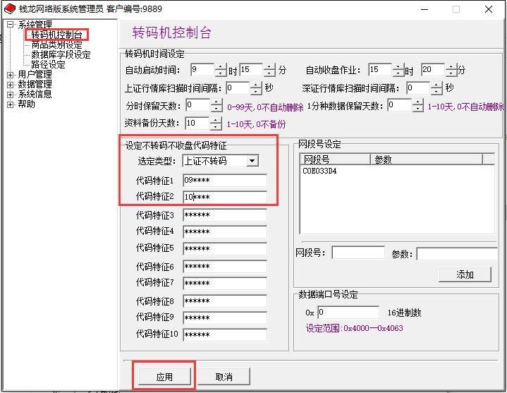

# Novell 内存溢出问题

如果上海商品数量为**1万多左右**会存在内存溢出问题！

## 解决办法

### 方法一

**1．升级前请完成以下准备工作：**

a)请确认沪深转码机已经收盘，所有客户端均已退出；

b)备份NOVELL服务器上以下目录及文件：

ML45\system\cfg目录

ML45\sysdata\realtime\shase\除子目录外的所有文件

ML45\sysdata\realtime\sznse\除子目录外的所有文件

c)将system目录拷贝到本地运行的，请同时备份win转码机本地system\cfg目录。

**2．修改WMANAGER配置：**

a)双击运行服务器上ml45\system\wmanager\wmanager.exe；

备注：wmanager.exe的默认密码为qianlong，若密码不正确，删除system\cfg\sys.pwl文件后，重新用qianlong密码进入。

b)进入系统管理--转码机控制台，编辑“上证不转码”的代码特征，修改如下：

（将system目录拷贝到本地运行的l2dcd用户，务必同步修改本地system\wmanager\wmanager.exe）

代码特征1改为：09****

代码特征2改为：10****

代码特征3改为：519***

代码特征4改为：521***

代码特征5改为：522***

代码特征6改为：523***

c)修改后，点击“应用”进行保存，见下图仅修改红框部分。



**3．重新初始化L2DCD转码机后才生效。**

重要提示：重新初始化会导致当天实时数据拉直线，故建议升级后待明天上午初始化前再开启转码机。

### 方法二

根据各营业部实际情况，加客户端参数以屏蔽部分市场代码。
```
/nohk  屏蔽港股（港股通）、期货、三板

/noqz  屏蔽期货、三板

/noneq 屏蔽三板
```
举例
```
lon /netnode
改成
lon /netnode /nohk
```

### 方法三

若营业部修改批处理有困难，根据实际需要直接改名realtime下相关市场目录
先停止股份转让转码机，再改目录名

realtime\shase  上海

realtime\sznse  深圳

realtime\hkse   香港

realtime\cnfol  期货

realtime\neeq   三板

友情提醒：以上1 2两步中，由于三板代码较多，而且为最后一个市场，可优先屏蔽三板。

### 方法四

清理ml45\user2下无用的网卡号目录。

清理方法：需要营业部仅保留现使用无盘站对应网卡号目录，多余的删掉。
